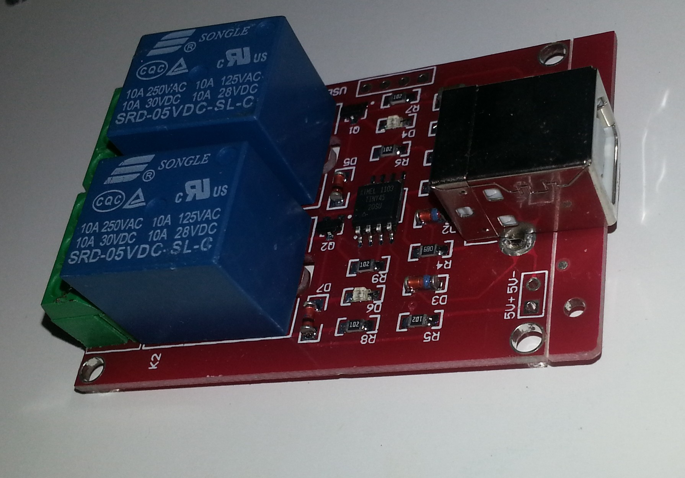

USB Relay driver for linux

A cheap USB relay available from Ebay has either single or dual relay output.
The double throw relay ratings are 10A 250VAC each.

The USB device is HID compatible and comes with Windows control software.
This code can control the relay vi HIDAPI which is a cross platform library. 
This code was tested under linux both on x86 and Raspberry Pi ARM.
The program is command line only as it is likely to be used by shell scripts.

The output of lsusb for the device is:
```
Bus 001 Device 003: ID 16c0:05df Van Ooijen Technische Informatica HID device except mice, keyboards, and joysticks

# lsusb -v -d 16c0:05df 

Bus 001 Device 003: ID 16c0:05df Van Ooijen Technische Informatica HID device except mice, keyboards, and joysticks
Device Descriptor:
  bLength                18
  bDescriptorType         1
  bcdUSB               1.10
  bDeviceClass            0 (Defined at Interface level)
  bDeviceSubClass         0 
  bDeviceProtocol         0 
  bMaxPacketSize0         8
  idVendor           0x16c0 Van Ooijen Technische Informatica
  idProduct          0x05df HID device except mice, keyboards, and joysticks
  bcdDevice            1.00
  iManufacturer           1 www.dcttech.com
  iProduct                2 USBRelay2
  iSerial                 0 
  bNumConfigurations      1
  Configuration Descriptor:
    bLength                 9
    bDescriptorType         2
    wTotalLength           34
    bNumInterfaces          1
    bConfigurationValue     1
    iConfiguration          0 
    bmAttributes         0x80
      (Bus Powered)
    MaxPower               20mA
    Interface Descriptor:
      bLength                 9
      bDescriptorType         4
      bInterfaceNumber        0
      bAlternateSetting       0
      bNumEndpoints           1
      bInterfaceClass         3 Human Interface Device
      bInterfaceSubClass      0 No Subclass
      bInterfaceProtocol      0 None
      iInterface              0 
        HID Device Descriptor:
          bLength                 9
          bDescriptorType        33
          bcdHID               1.01
          bCountryCode            0 Not supported
          bNumDescriptors         1
          bDescriptorType        34 Report
          wDescriptorLength      22
         Report Descriptors: 
           ** UNAVAILABLE **
      Endpoint Descriptor:
        bLength                 7
        bDescriptorType         5
        bEndpointAddress     0x81  EP 1 IN
        bmAttributes            3
          Transfer Type            Interrupt
          Synch Type               None
          Usage Type               Data
        wMaxPacketSize     0x0008  1x 8 bytes
        bInterval              20
Device Status:     0x0000
  (Bus Powered)
```
HIDAPI

http://www.signal11.us/oss/hidapi

HIDAPI is a fairly recent addition to linux and is available as a package for Fedora 20 but not for Pidora (F18). 
The package was built for Pidora (Fedora 18) using the F20 hidapi source package.

Protocol:
The relay modules does not set the USB serial number but has a unique serial when the HID device is queried, the current state of the relays is also sent with the serial.
The HID serial is matched and the ON/OFF command is sent to the chosen relay.

Building the code:
Assuming the hidapi and hidapi-devel packages have been installed. Note that there are two options for the hidapi library: hidapi-hidraw or hidapi-libusb. Different distributions have better results with one or the other. YMMV.

```
### hidapi-hidraw 
# gcc -o usbrelay usbrelay.c -lhidapi-hidraw
### hidapi-libusb
# gcc -o usbrelay usbrelay.c -lhidapi-libusb
```
Usage:
The code needs to access the device. This can be achieved either by running the program with root privileges (so sudo is your friend) or by putting
```
SUBSYSTEM=="usb", ATTR{idVendor}=="16c0",ATTR{idProduct}=="05df", MODE="0666"
KERNEL=="hidraw*", ATTRS{busnum}=="1", ATTRS{idVendor}=="16c0", ATTRS{idProduct}=="05df", MODE="0666"
```
to `/etc/udev/rules.d/50-dct-tech-usb-relay-2.rules`.

Running the program will display each module that matches device 16c0:05df the debug information is sent to stderr while the state is sent to stdout for use in scripts. The only limit to the number of these relays that can be plugged in and operated at once is the number of USB ports.
```
$ sudo ./usbrelay
Device Found
  type: 16c0 05df
  path: /dev/hidraw1
  serial_number: 
  Manufacturer: www.dcttech.com
  Product:      USBRelay2
  Release:      100
  Interface:    0
PSUIS_1=1
PSUIS_2=0
```
To get the relay state
```
$ sudo ./usbrelay 2>/dev/null
PSUIS_1=1
PSUIS_2=0
```
To use the state in a script:
```
$ eval $(sudo ./usbrelay 2>/dev/null)
$ echo $PSUIS_2
0
```
To set the relay state of 1 or more modules at once:
```
$ sudo ./usbrelay PSUIS_2=0
$ sudo ./usbrelay PSUIS_2=1 PSUIS_1=0
$ sudo ./usbrelay PSUIS_2=0 PSUIS_1=1 0U70M_1=0 0U70M_2=1
```
If for some reason the USB id changes, (ie other than 16c0:05df) set the USBID environment variable to the correct ID
```
$sudo USBID=16c0:05df ./usbrelay
```

Enjoy
