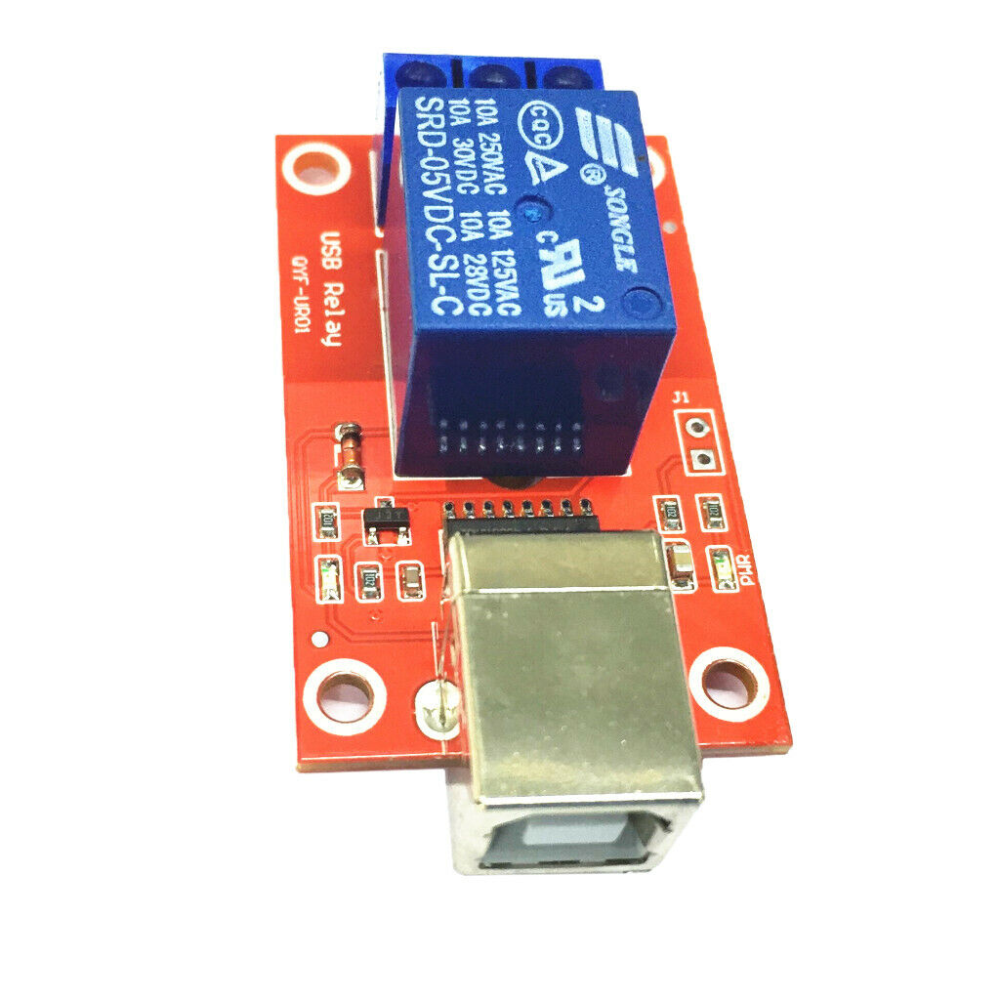

# USB Relay Driver For Linux


A cheap USB relay available from Ebay with 1,2,4 or 8 relay output.
The double throw relay ratings are 10A 250VAC each.

The USB device is HID compatible and comes with Windows control software.
This code can control the relay vi HIDAPI which is a cross platform library. 
This code was tested under linux both on x86 and Raspberry Pi ARM.
The program is command line only as it is likely to be used by shell scripts.

The output of lsusb for the device is:
```
Bus 001 Device 003: ID 16c0:05df Van Ooijen Technische Informatica HID device except mice, keyboards, and joysticks

# lsusb -v -d 16c0:05df 

Bus 001 Device 003: ID 16c0:05df Van Ooijen Technische Informatica HID device except mice, keyboards, and joysticks
Device Descriptor:
  bLength                18
  bDescriptorType         1
  bcdUSB               1.10
  bDeviceClass            0 (Defined at Interface level)
  bDeviceSubClass         0 
  bDeviceProtocol         0 
  bMaxPacketSize0         8
  idVendor           0x16c0 Van Ooijen Technische Informatica
  idProduct          0x05df HID device except mice, keyboards, and joysticks
  bcdDevice            1.00
  iManufacturer           1 www.dcttech.com
  iProduct                2 USBRelay2
  iSerial                 0 
  bNumConfigurations      1
  Configuration Descriptor:
    bLength                 9
    bDescriptorType         2
    wTotalLength           34
    bNumInterfaces          1
    bConfigurationValue     1
    iConfiguration          0 
    bmAttributes         0x80
      (Bus Powered)
    MaxPower               20mA
    Interface Descriptor:
      bLength                 9
      bDescriptorType         4
      bInterfaceNumber        0
      bAlternateSetting       0
      bNumEndpoints           1
      bInterfaceClass         3 Human Interface Device
      bInterfaceSubClass      0 No Subclass
      bInterfaceProtocol      0 None
      iInterface              0 
        HID Device Descriptor:
          bLength                 9
          bDescriptorType        33
          bcdHID               1.01
          bCountryCode            0 Not supported
          bNumDescriptors         1
          bDescriptorType        34 Report
          wDescriptorLength      22
         Report Descriptors: 
           ** UNAVAILABLE **
      Endpoint Descriptor:
        bLength                 7
        bDescriptorType         5
        bEndpointAddress     0x81  EP 1 IN
        bmAttributes            3
          Transfer Type            Interrupt
          Synch Type               None
          Usage Type               Data
        wMaxPacketSize     0x0008  1x 8 bytes
        bInterval              20
Device Status:     0x0000
  (Bus Powered)
```
___

## HIDAPI

http://www.signal11.us/oss/hidapi

HIDAPI is a fairly recent addition to linux and is available as a package for Fedora 20 but not for Pidora (F18). 
The package was built for Pidora (Fedora 18) using the F20 hidapi source package.

### Installing Debian Packages:
This code is a maintained package in Debian (and Raspian). Use normal apt-get commands:

```
$ sudo apt-get install usbrelay
```

Other Linux platforms will need to build the source, see below

### Protocol:
The relay modules does not set the USB serial number but has a unique serial when the HID device is queried, the current state of the relays is also sent with the serial.
The HID serial is matched and the ON/OFF command is sent to the chosen relay.

### Building The Code:
The usual make, make install dance assuming the hidapi and hidapi-devel packages have been installed. Note that there are two options for the hidapi library: hidapi-hidraw or hidapi-libusb. Different distributions have better results with one or the other. YMMV. 

```
$ sudo apt-get install libhidapi-dev libhidapi-hidraw0 git 
$ git clone https://git.com/darrylb123/usbrelay
$ cd usbrelay
$ make
$ sudo make install
### Test with a usbrelay plugged in
$ sudo usbrelay

### Build the python interface using the instructions below

To choose the alternative hidapi libraries, add the option to the make command line

### hidapi-hidraw - This is the default if no option is given
$ make HIDAPI=hidraw
### hidapi-libusb
$ make HIDAPI=libusb
```

### Docker Build:
You can also build using Docker. Assuming you have Docker installed (only tested with version 18), execute the build script:

```
$ ./build.sh
```

The usbrelay binary, libusbrelay.so and libusbrelay_py.so libraries will be built in the root directory of the repo.

### Usage:
The code needs to access the device. This can be achieved either by running the program with root privileges (so sudo is your friend) or by putting
```
SUBSYSTEM=="usb", ATTR{idVendor}=="16c0",ATTR{idProduct}=="05df", MODE="0666"
KERNEL=="hidraw*", ATTRS{busnum}=="1", ATTRS{idVendor}=="16c0", ATTRS{idProduct}=="05df", MODE="0666"
```
to `/etc/udev/rules.d/50-dct-tech-usb-relay-2.rules`.

Running the program will display each module that matches device 16c0:05df the debug information is sent to stderr while the state is sent to stdout for use in scripts. The only limit to the number of these relays that can be plugged in and operated at once is the number of USB ports.
```
$ sudo ./usbrelay
Device Found
  type: 16c0 05df
  path: /dev/hidraw1
  serial_number: 
  Manufacturer: www.dcttech.com
  Product:      USBRelay2
  Release:      100
  Interface:    0
PSUIS_1=1
PSUIS_2=0
```
To get the relay state
```
$ sudo ./usbrelay 2>/dev/null
PSUIS_1=1
PSUIS_2=0
```
To use the state in a script:
```
$ eval $(sudo ./usbrelay 2>/dev/null)
$ echo $PSUIS_2
0
```
To set the relay state of 1 or more modules at once:
```
$ sudo ./usbrelay PSUIS_2=0
$ sudo ./usbrelay PSUIS_2=1 PSUIS_1=0
$ sudo ./usbrelay PSUIS_2=0 PSUIS_1=1 0U70M_1=0 0U70M_2=1
```

Change the serial permanently

Use the fictitious relay 0 to set the serial permanently. If you have duplicate serials, make sure only one is plugged in when you change it.
Maximum of 5 character serial. It is probably sensible to change one module at a time to avoid serial collisions.

```
$ sudo ./usbrelay
Device Found
  type: 16c0 05df
  path: /dev/hidraw4
  serial_number: 
  Manufacturer: www.dcttech.com
  Product:      USBRelay2
  Release:      100
  Interface:    0
  Number of Relays = 2
ZXCV_1=0
ZXCV_2=0

$ sudo ./usbrelay ZXCV_0=ZAQ12
Orig: ZXCV, Serial: ZXCV, Relay: 0 State: 0
Device Found
  type: 16c0 05df
  path: /dev/hidraw4
  serial_number: 
  Manufacturer: www.dcttech.com
  Product:      USBRelay2
  Release:      100
  Interface:    0
  Number of Relays = 2
Serial: ZXCV, Relay: 0 State: 0 
1 HID Serial: ZXCV 
Serial: ZXCV, Relay: 0 State: 0 --- Not Found

$ sudo ./usbrelay
Device Found
  type: 16c0 05df
  path: /dev/hidraw4
  serial_number: 
  Manufacturer: www.dcttech.com
  Product:      USBRelay2
  Release:      100
  Interface:    0
  Number of Relays = 2
ZAQ12_1=0
ZAQ12_2=0
```

### Python Extension: 
This also optionally includes a python extension. In order to build the python extension, you must have the Python 3 development libraries installed. The docker build process will produce the python library as well.

Debian:
```
##Install Python3 dev package
# sudo apt install libpython3.5-dev
```

Fedora:
```
##Install Python3 dev pacakage
# yum install python3-devel
```

With the dependency installed, the library can be built and installed with:
```
##Build libusbrelay_py.so
$ make python
##Install to global python
$ sudo make install_py
```

Once installed, the library can be used by any python script, assuming it is running as a user with suitable permissions per the changes to udev above.

The following is a test script included as test.py, showing how to use the library:
```
import usbrelay_py
import time

count = usbrelay_py.board_count()
print("Count: ",count)

boards = usbrelay_py.board_details()
print("Boards: ",boards)

for board in boards:
    print("Board: ",board)
    relay = 1
    while(relay < board[1]+1):
        result = usbrelay_py.board_control(board[0],relay,1)
        print("Result: ",result)
        relay += 1
        
    relay = 1
    while(relay < board[1]+1):
        result = usbrelay_py.board_control(board[0],relay,0)
        print("Result: ",result)
        relay += 1
```

Once the library is installed, you can run the test script in python as follows:
```
[[$ python3 test.py
```
It will turn on and then off every relay attached to every board on your system.

## Support for Ucreatefun USB Modules



A USB relay became available that is supported by the software but with severe limitations
- Status of the relays is not available
- There is no serial so there can only be one of these modules attached to a system. The module has a USB serial number of A0001 on every module.
- The number of relays is not available

The module has a USB device ID of 0519:2018.
There are modules with 1,2,4,and 8 relays. The module accepts a request for relay 9 which turns on/off all relays.
Operating the module works the same as for the DccTech modules except the serial used is A0001
Running usbrelay without arguments prints nothing to stdout
```
$ sudo ./usbrelay A0001_2=1 # Turns on relay 2
$ sudo ./usbrelay A0001_9=1 # turns on all relays
```


Enjoy
